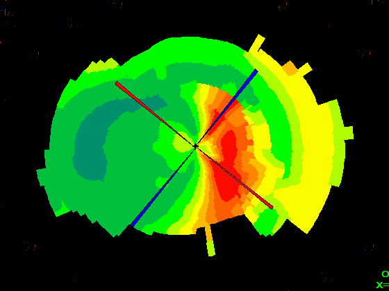
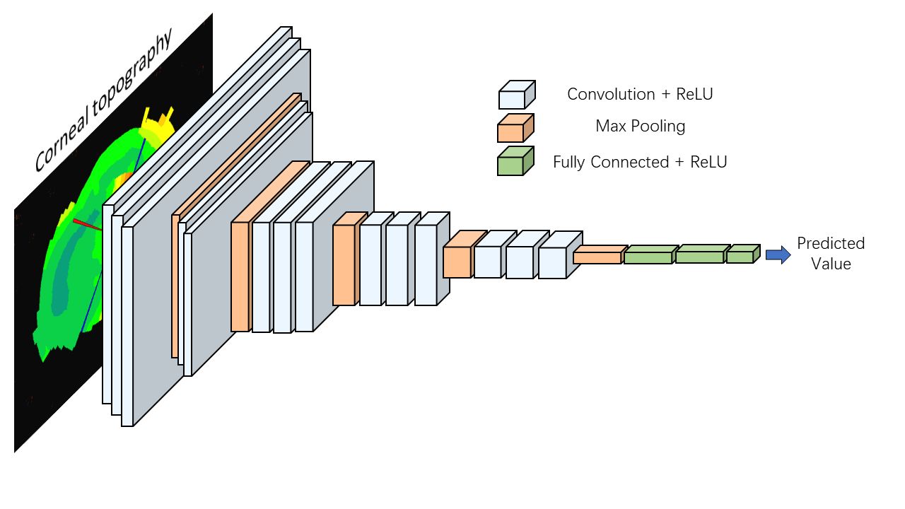

# Prediction-of-Keratomileusis-Parameters
### Introduction

This project is about the prediction of keratomileusis parameters. With  corneal topography like figure 1, we train the model to predict the three parameters, FK, degradation, and diameter.

​                                             figure 1: corneal topography 

> Note: Our project uses real data from hospitals. The dataset is protected from public disclosure by us to avoid patient privacy breaches.

### Structure

The main structure of our project is based on VGG-16, as shown in figure 2

​                                                                                     figure 2: model structure                

### Environment

python3.7

tensorflow2.4.1

keras

### Result

In our project, we compared the effects of three models: Inception, Resnet, and VGG-16, and the results are shown in Table 1.

| Pre Para   | Degradation |          |        | FK       |          |       | Diameter |          |       |
| ---------- | ----------- | -------- | ------ | -------- | -------- | ----- | -------- | -------- | ----- |
| Error Type | MAE         | RMSE     | MAPE   | MAE      | RMSE     | MAPE  | MAE      | RMSE     | MAPE  |
| Inception  | 1.179692    | 1.461184 | 39.49% | 1.253006 | 2.50939  | 2.91% | 0.415652 | 0.927672 | 3.89% |
| ResNet     | 1.03443     | 1.257681 | 33.95% | 0.653797 | 1.040278 | 1.53% | 0.362999 | 0.526376 | 3.42% |
| VGG-16     | 0.9107      | 1.1139   | 27.76% | 0.6174   | 0.8352   | 1.45% | 0.203    | 0.2556   | 1.89% |

### Contact

If you have any question, please email to ariasulg2020@gmail.com .